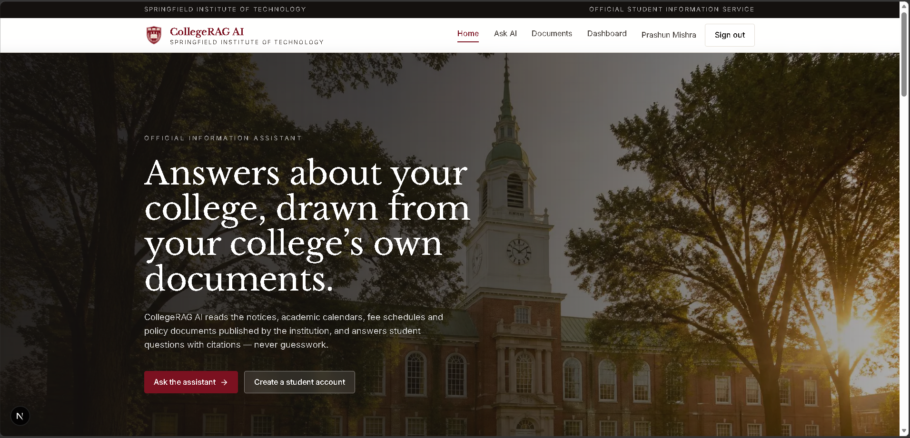
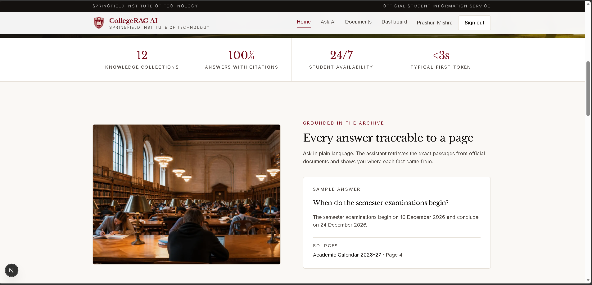
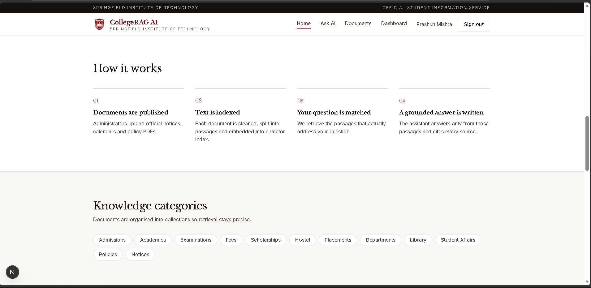
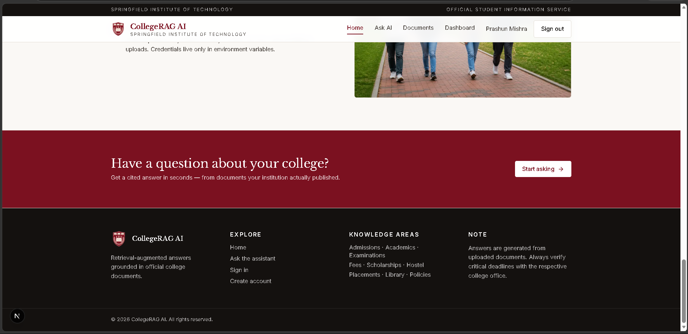
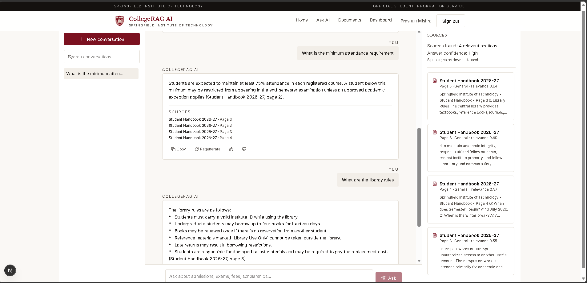
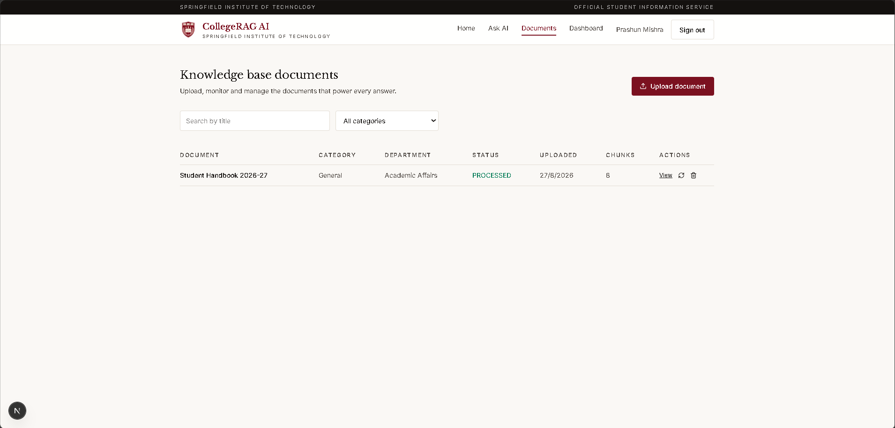
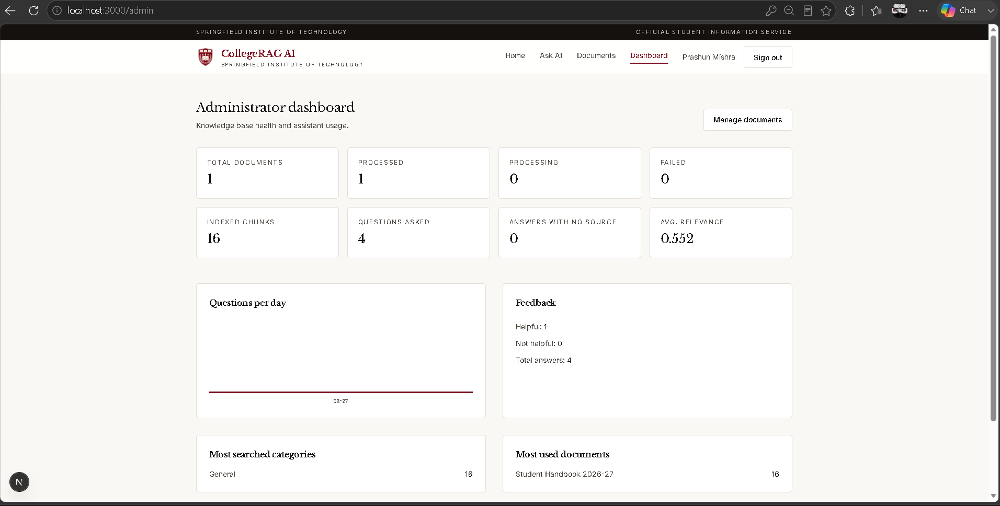
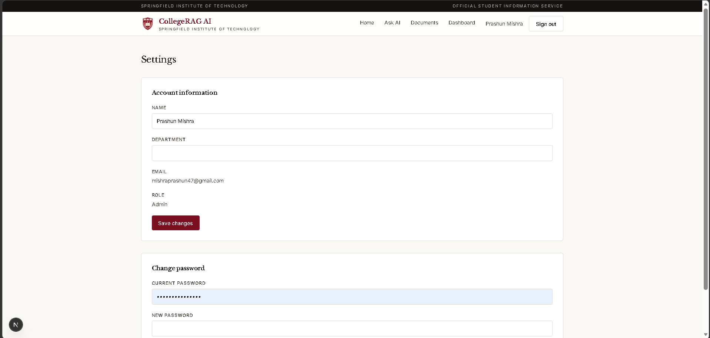

# College-RAG-AI

An intelligent, production-ready Retrieval-Augmented Generation (RAG) college assistant platform. Students can ask natural language questions and receive accurate, context-grounded answers extracted strictly from official college documents with precise source citations, page numbers, and relevance metrics.

---

## 1. Project Name
**College-RAG-AI** (College Information & Academic Knowledge Assistant)

---

## 2. Problem Statement
College information is frequently scattered across disparate PDFs—academic calendars, student handbooks, fee regulations, hostel rules, exam notices, and placement circulars. Students struggle to find fast, verified answers, while standard generic chatbots frequently hallucinate dates, fees, and guidelines. 

**College-RAG-AI** solves this by implementing an end-to-end RAG pipeline that indexes verified institutional documents. Queries are embedded, matched via hybrid vector + keyword search, reranked, and synthesized into grounded answers. If no relevant document contains the answer, the system gracefully declines to answer rather than fabricating facts.

---

## 3. Features

### 🎓 Student Features
- **Grounded Conversational AI**: Natural language question answering strictly backed by institutional documentation.
- **Transparent Source Citations**: Real-time citations displaying document name, exact page number, category, and relevance score.
- **Streaming Responses**: Token-by-token low-latency Server-Sent Events (SSE) streaming.
- **Conversation Management**: Multi-session chat history (create, rename, delete, switch between conversations).
- **Interactive Actions**: One-click answer copying, regeneration, and stop generation controls.
- **Feedback Loop**: Thumbs up/down rating with reason codes to monitor answer quality.
- **Suggested Prompts**: Quick-start prompts for instant access to common queries.

### 🛡️ Administrative & Knowledge Base Features
- **Document Management**: Multi-category PDF upload (General, Academics, Admissions, Examinations, Fees, Hostels, Placements).
- **Automated Processing Pipeline**: Real-time ingestion status tracking (`UPLOADED` → `PROCESSING` → `PROCESSED` → `FAILED`).
- **Chunk & Vector Inspection**: Inspect extracted chunks, vector IDs, and reprocess or delete documents.
- **Analytics & Usage Dashboard**: Track total questions, document breakdown, category distribution, feedback ratios, and average retrieval relevance.
- **Role-Based Access Control**: Secure JWT-based authentication with automatic initial administrator bootstrap.

---

## 4. Technology Stack

| Domain | Technology / Library |
| :--- | :--- |
| **Frontend** | Next.js 15 (App Router), React 19, TypeScript, Tailwind CSS v4, Zustand, Lucide React |
| **Backend API** | Node.js, Express, TypeScript, Mongoose, Multer, Helmet, CORS, Rate Limiting |
| **Database** | MongoDB (MongoDB Atlas / Local Community Server) |
| **Vector Database** | Pinecone Vector DB (Serverless, Cosine Metric, 768 Dimensions) |
| **AI & Embeddings** | Google Gemini (`gemini-2.5-flash` / `gemini-3.6-flash`, `gemini-embedding-001`) |
| **Document Processing**| `pdfjs-dist` (Modern PDF text extraction, sentence-aware chunking) |
| **Authentication** | JSON Web Tokens (JWT), HTTP-only Cookies / Bearer Auth, bcryptjs |

---

## 5. Screenshots

### Home Page & Overview
| Home (Hero & Overview) | Home (Features & Exploration) |
| :---: | :---: |
|  |  |

| Home (How It Works) | Home (Footer & Access) |
| :---: | :---: |
|  |  |

### Interactive Chat & AI Grounding
| AI Chat with Real-time Source Citations |
| :---: |
|  |

### Knowledge Base & Document Management
| Admin Document Ingestion & Status |
| :---: |
|  |

### Admin Dashboard & Analytics
| Metrics & Usage Analytics | Settings & Configurations |
| :---: | :---: |
|  |  |

---

## 6. Live Demo
- **Frontend URL (Vercel)**: `https://college-rag-ai.vercel.app` *(Replace with your deployed Vercel domain)*
- **Demo Credentials**: Register a new account on the live instance (the first registered account automatically becomes the administrator).

---

## 7. Backend
- **API Base URL**: `https://college-rag-ai-api.onrender.com` *(Replace with your deployed backend domain)*
- **Health Check Endpoint**: `/api/health`
- **Supported Deployment Environments**: Render, Railway, Fly.io, AWS EC2, or Docker.

---

## 8. Setup Instructions

### Prerequisites
- **Node.js**: v20.x or newer
- **npm** or **bun** / **yarn**
- **MongoDB**: Free MongoDB Atlas cluster or local MongoDB instance
- **Pinecone**: Free Pinecone account
- **Google AI Studio**: Free Gemini API Key

---

### Step 1: Clone the Repository
```bash
git clone https://github.com/Prashun-Mishra/College-RAG-AI.git
cd College-RAG-AI
```

---

### Step 2: Configure Environment Variables

1. **Backend Environment**:
   ```bash
   cd backend
   cp .env.example .env
   ```
   Fill in your API keys in `backend/.env` (see [Environment Variables](#9-environment-variables)).

2. **Frontend Environment**:
   ```bash
   cd ../frontend
   cp .env.example .env.local
   ```

---

### Step 3: Install Dependencies & Run Backend

In your first terminal:
```bash
cd backend
npm install
npm run dev
```
The backend will launch at `http://localhost:5000`.

---

### Step 4: Install Dependencies & Run Frontend

In a second terminal:
```bash
cd frontend
npm install
npm run dev
```
The frontend will launch at `http://localhost:3000`.

---

### Step 5: Initial Setup & Verification
1. Navigate to `http://localhost:3000/register`.
2. Register your administrator account.
3. Go to **Documents** (`/documents` or `/admin/documents`) and upload institutional PDFs.
4. Go to **Ask AI** (`/chat`) to start asking questions grounded in your uploaded documents.

---

## 9. Environment Variables

> **⚠️ Security Warning:** Never commit `.env` or sensitive credentials to version control. The `.gitignore` file is preconfigured to prevent accidental leakage.

### Backend (`backend/.env`)

| Variable Name | Required | Description | Example / Default |
| :--- | :---: | :--- | :--- |
| `PORT` | Optional | Port for the Express server | `5000` |
| `NODE_ENV` | Optional | Application runtime environment | `development` |
| `CLIENT_URL` | Required | Allowed CORS origin for frontend | `http://localhost:3000` |
| `MONGODB_URI` | **Required** | MongoDB connection string | `mongodb+srv://<user>:<password>@cluster.mongodb.net/collegerag` |
| `JWT_SECRET` | **Required** | Strong random string for signing JWT tokens | `your-secure-random-secret-key` |
| `JWT_EXPIRES_IN` | Optional | JWT session validity duration | `7d` |
| `AI_PROVIDER` | Optional | AI LLM provider (`gemini` or `openrouter`) | `gemini` |
| `GEMINI_API_KEY` | **Required** | Google Gemini API Key from Google AI Studio | `AIzaSy...` |
| `GEMINI_CHAT_MODEL` | Optional | Gemini chat model version | `gemini-2.5-flash` |
| `EMBEDDING_MODEL` | Optional | Embedding model for semantic vector creation | `gemini-embedding-001` |
| `EMBEDDING_DIMENSIONS` | Optional | Dimensions for vector embeddings | `768` |
| `PINECONE_API_KEY` | **Required** | Pinecone API key | `pcsk_...` |
| `PINECONE_INDEX` | **Required** | Pinecone index name | `collegerag` |
| `PINECONE_NAMESPACE` | Optional | Pinecone namespace partition | `default` |
| `CHUNK_SIZE` | Optional | Character length per document chunk | `1000` |
| `CHUNK_OVERLAP` | Optional | Character overlap between chunks | `150` |
| `TOP_K` | Optional | Number of candidate chunks retrieved | `8` |
| `RERANK_TOP_N` | Optional | Number of reranked passages sent to LLM | `4` |
| `MIN_RELEVANCE_SCORE` | Optional | Minimum relevance threshold for answering | `0.3` |
| `UPLOAD_DIR` | Optional | Local file upload directory | `uploads` |
| `MAX_UPLOAD_MB` | Optional | Maximum PDF file upload size | `25` |

### Frontend (`frontend/.env.local`)

| Variable Name | Required | Description | Example / Default |
| :--- | :---: | :--- | :--- |
| `NEXT_PUBLIC_API_URL` | **Required** | Base URL pointing to the Express backend API | `http://localhost:5000/api` |
| `NEXT_PUBLIC_COLLEGE_NAME` | Optional | Display name of the educational institution | `Springfield Institute of Technology` |

---

## 10. License
This project is licensed under the [MIT License](LICENSE).
